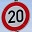
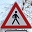
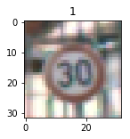
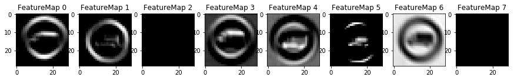
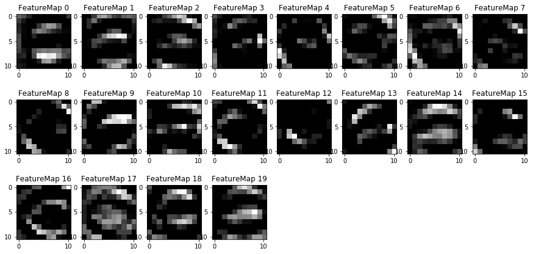

#**Traffic Sign Recognition** 

---
## Introduction
In this project, a traffic sign classifier using a deep learning algorithm is implemented. The input image is first normalized and then feed through a deep neural network. This network consists of two convolutional, and three fully connected layers. Also, pooling and dropout are applied to the network in order to reduce the number of trainable variables and avoid overfitting the model.

## Objectives

* Load the training, validation and test data sets
* Explore, summarize and visualize the data set
* Design, train and test a model architecture
* Use the model to make predictions on new images
* Analyze the softmax probabilities of the new images
* Summarize the results with a written report

## Rubric Points

### Dataset summary
The dataset contains 43 classes of German traffic sign images, each of them sorted and labeled. Three sets are considered, for training, validation and testing. 
The dataset was obtained from the *Institut für Neuroinformatik* from the **Ruhr Universität Bochum** 
[Data set link](http://benchmark.ini.rub.de/?section=gtsrb&subsection=dataset)

Image data shape = (32, 32, 3)

Number of classes = 43

Number of training examples = 34799

Number of validation samples = 4410

Number of testing samples = 12630

### Exploratory visualization
After loading the data, some of its characteristics of are analyzed. The code is presented in [Traffic sign classifier algorithn](https://github.com/toshiharutf/CarND-Term1-Traffic_sign_classifier_P2/blob/master/Traffic_Sign_Classifier.ipynb).
First, the number of occurrences for each of the 43 traffic sign classes is shown in a bar graph plot. It can be seen that the number of samples per class presents a high variance, which may lead to higher accuracies for some traffic sign classes over the others.

Then, the top least common traffic signs occurrances are shown, so the user can predict in which classes, the classifier may present problems.

Finally, all the 43 classes are shown, in order of label from 0 to 43.

### Preprocessing
A simple division over 255 for all the three layers (RGB) of each of the images is made. Other normalizations methods were tested (histogram equalization), but showed poorer results than the division by 255. Possibly, the equalization was not correctly implemented. However, up to 96% accuracy in the validation test was reached, which shows that this simple normalization work just fine.

Also, the images were **NOT** greyscaled, because **color is an important feature** in the traffic signs recognition.

[0 ~ 255]  -->  [0 ~ 1]

### Model architecture
The deep learning net was based on the LeNet network presented in the course. 
The network layers are the following:

**1) Convolutional**
	Input : 32x32x2
	Output: 29x29x6

**ReLU activation**

**2) Max pooling**
Input : 29x29x8
Output: 14x14x8

**3) Convolutional**
Input : 14x14x8
Output: 11x11x20

**ReLU activation**

**4) Max pooling**
Input : 11x11x20
Output: 5x5x12

**Flatten**

**3) Fully conected**
Input : 500
Output: 250

**ReLU activation**

**Dropout (50%)**

**4) Fully conected**
Input : 250
Output: 125

**ReLU activation**

**Dropout (50%)**

**5) Fully conected**
Input : 125
Output: 43

**OUTPUT 43 logits**

### Model training and hyperparameters
The weights were obtained using the Adam optimizer function within Tensorflow.
The learning rate chosen was 0.001.
Dropout rate for training: 50%
An EPOCHS of 10 and BATCH of 128 showed good results. Increasing the EPOCHS did not increase the accuracy, and in fact, tended to overfit the model. Increasing the batch reduced the perfomance of the model.

### Solution approach
With the hyperparameters and network structure shown above, accuracies up to 99.5% in the training and 96% in the validation set were reached.
In the test set, up to 94% was reached.

### Acquiring new images
Six new images were acquired from the web. Five of them were randomly chosen within the 43 classes of images, and one of them was selected from within the top 5 least common samples.
For the first five images, some of them were particurly chosen, because they could represent more challenge to the network. For example, the stop sign is slightly rotated, and the keep left sign is translucent and backlighted.
The six images are shown here, after cropping an resizing

**Challenge image**

**Randomly chosen images**

 
(*Notice the rotation*)

(*This photo was taken from a translucent backlighted sign at night*)

### Perfomance on new images
The classifier reached 83.3 % accuracy, which represents 5 out of 6 images. 

By analyzing the softmax probabilities, it can be seen that **challenge image**, the *Speed limit sign 20*, was incorrectly classified as *Speed limit sign 30* - tag="1" (shown below).
This result is not that surprising, since both images look very similar. Since there are only few examples for this particular sign class, a poorer performance was expected. 
Notice from the softmax probabilities, that the *most probable* class only reached 61%, compared to the other correctly labeled signs which reached over 90% probability. The second most probable option was actually the correct one (tag = "0") and reached a 38% probability. From these results, a **low recall for the speed limit 20** is expected, and probably also for the other top least common examples.

All the other images present a softmax probability higher than 90%, which suggest a high recall for their sign classes.

[[  6.19544864e-01,   3.80353332e-01,   1.01845006e-04,  6.63124533e-09,   1.11641481e-10],  # Challenge image 

[  9.99997497e-01,   2.55872624e-06,   2.00896473e-08,  5.87802640e-10,   6.53366389e-11],   # Stop

[  9.99999881e-01,   9.66549152e-08,   3.56335117e-09,  7.17805763e-12,   2.88520098e-12],   # Caution 

[  9.08866107e-01,   8.83138552e-02,   2.74912571e-03,  6.92418616e-05,   1.61772118e-06],   # Curve left 

[  9.91131127e-01,   8.34569894e-03,   4.75316105e-04,  4.76100286e-05,   1.58969641e-07],   # Pedestrians

[  9.99216914e-01,   7.80808623e-04,   1.59961837e-06,  3.24611392e-07,   2.57060719e-07]]   # Keep left

indices=array( 
[
[ 1,  0,  4, 18, 17], # Challenge image (label 0) **Mismatch!!!**

[14, 17, 29,  3,  5], # Stop (label 14)

[18, 27, 26,  4, 40], # Caution (label 18)

[19, 24, 31, 21, 27], # Curve left (label 19)

[27, 18, 24, 11, 21], # Pedestrians (label 27)

[39, 33,  4, 37,  2]  # Keep left (label 39)
 ]

### Visualization of the hidden layers
The provided function for observing the hidden layer was used for two convolutional layers of the network. The fully connected layers were not visualized, since the could not recreate a square figured.
For the first convolutional layer, the visualization showed the contours of the image, very similar to the output of the Canny edge detection algorithm. 

For the second layer, the visualization is more complex and the initial low resolution of the image did not help.

### Conclusions

The initial network pipeline was based on the LeNet program provided in the course. It was modified by increasing the depth of the convolutional layers and the size of the fully connected layers.
The size for each layer was changed by test and trial methodology. The other hyperparameters were not changed during the trainings sessions.
The model was trained in a personal PC with a GTX-680 gpu, which reduced the training time for each test.
Dropout was implemented in the fully connected layers, to avoid overfitting of the model.

